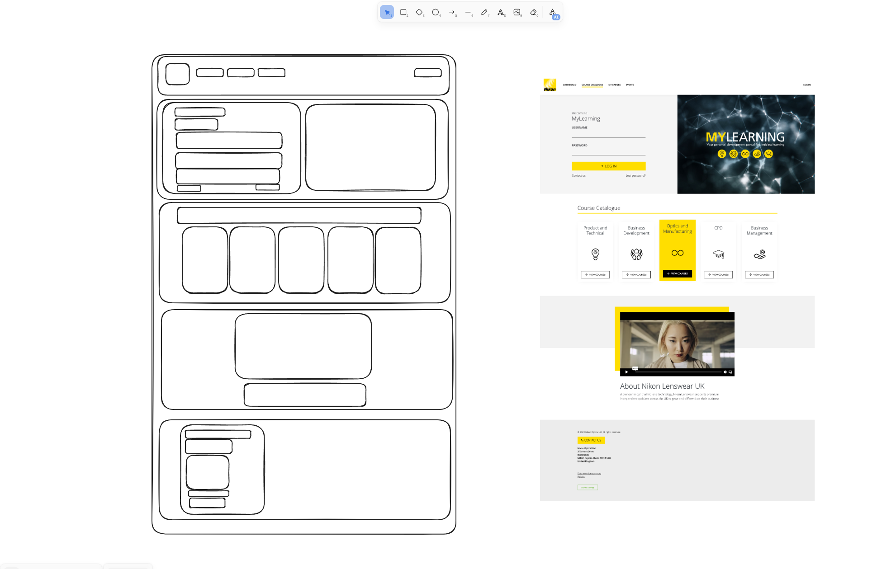

# Nikon MyLearning Clone

A cloned version of the Nikon MyLearning platforms landing page using Bootstrap, Javascript and some custom CSS as needed.
<br />
Testing completed with Jest framework.

## Getting Started

### Installation

* Open index.html to view page
* to run tests install NPM packages
   ```sh
   npm install
   ```
* Run testing using
  ```sh
  npm test
  ```

## Ancknowledgements

* [Initial HTML boilerplate generated using HTMLBoilerplates](https://htmlboilerplates.com/)
* [Jest config created using documentation](https://jestjs.io/docs/configuration)

## Creation Process

1. Used [Excalidraw](https://excalidraw.com/) to help visualize concept image as elements


2. Create base project, with separate HTML, JS and CSS files. Custom CSS will still be necessary, even with Bootstrap as some pre-built elements need to be changed to closer match the concept.

3. Using TDD implement the navbar. Key points of this process were:
* Increased logo and font size for better accessibility.
* Javascript implementation of changing nav bar links on hover.

4. Using TDD implement login section. Key points of this process were:
* Using Bootstrap's grid utilities to evenly space the sections.
* Using inbuilt Bootstrap elements to create the form and applying custom CSS to match the concept image.
* Javascript implementation of changing log in button style on hover.
* Javascript implementation of a warning feature if both form inputs aren't filled in, using Bootstrap warnings.

5. Using TDD implement course catalogue section. Key points of this process were:
* Swapping out provided assets. The provided assets were too low quality. They were swapped out for similar looking SVG placeholders as these don't have the same scaling issues. In a real work environment I would have to go back to whoever provided the assets and ask that they give me either higher quality PNG's or SVG's (preferred especially in this case of icons).
* Using Bootstrap's pre-made cards to contain the course options as they is an easy built-in solution to make sure they are spaced and sized correctly even as the screen size is changed.
* Javascript implementation of changing cards and view courses buttons on hover.
* Increased text and icon size for better accessibility.

6. Using TDD implement about Nikon section. Key points of this process were:
* Centered text content to match the rest of the centered page.
* Javascript implementation of the background shifting on mouseover of the video for better user interaction.
* Went back to the course catalog cards and added the same smooth transform to the card background colour changes as the about background shift.

7. Using TDD implement footer section. Key points of this process were:
* Reuse custom-button class for the contact us button.
* Use built-in Bootstrap success button for cookies settings.
* Add gray background colour to login section.

8. Run page through an [accessibility checker](https://chromewebstore.google.com/detail/siteimprove-accessibility/djcglbmbegflehmbfleechkjhmedcopn) to make sure it meets modern statndards
* Update heading elements to have a specific structure
* Update the first headings to be h1
* Update cookies button colours to a green that meets the 7:1 contrast standard
* Add hidden skip to main content button for keyboard users